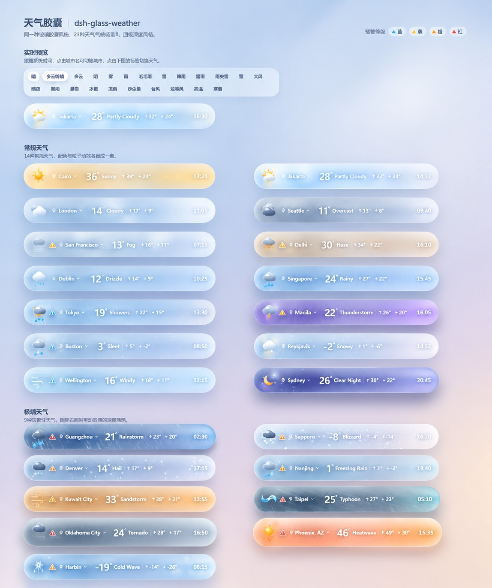
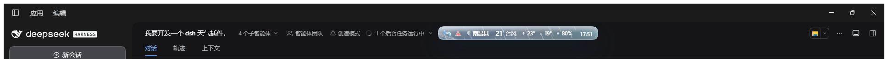

# dsh-glass-weather

[](https://www.npmjs.com/package/dsh-glass-weather)
[](LICENSE)

DeepSeek Harness（DSH）原生 Cordis 插件：在会话顶栏放一颗 **30px 玻璃天气胶囊**，并注册 `get_weather` 工具。

**兼容性**：DSH Desktop / dsh web **0.2.0-rc.2**（原生 Cordis 插件，不是 hook 桥接）。已在 `package.json` 声明 `engines.dsh: ^0.2.0-rc.2` 与 `dsh.compatibility`，插件市场据此显示适用范围；其余版本未验证。

<picture>
  <source media="(prefers-color-scheme: dark)" srcset="docs/states-dark.jpg">
  
</picture>

**23 种天气状态**，每种自带玻璃配色、SVG 图形与 canvas 粒子（雨、雪、星、沙尘、漩涡…），灾害天气带预警角标。
图标 / 城市 / 温度 / 天气 / 今日最高最低 / 湿度 / 时间都能在设置里单独开关。

实际运行时的顶栏：



## 安装

已发布到 npm：<https://www.npmjs.com/package/dsh-glass-weather>

```powershell
dsh plugin --profile desktop add dsh-glass-weather     # 从 npm 装（推荐）
scripts\mount-profile.cmd desktop                      # 或本地源码挂载（开发用）
```

改 Host 半需重启 dsh；只改浏览器半会自动热更。

## 使用

- 顶栏胶囊单击刷新，悬停看完整信息；没有展开卡，胶囊就是全部界面。
- 设置 → 插件 → 「天气」：顶部实时预览，下面四组 —— 显示内容 / 外观与动效 / 数据与位置 / 高级（含「恢复本机默认显示」）。
- 本机开关（显示项、粒子、手动天气状态）存在浏览器 localStorage。
- 模型可用 `get_weather` 查询实时天气与短期预报。

## 数据来源

全部免密钥、免账号：Open-Meteo 天气 + 空气质量（霾/沙尘判定）、BigDataCloud 反向地理编码取县市名、ipapi 兜底。
任一接口失败都会降级到 WMO 天气码，不会崩。

## 开发与验收

```powershell
npm run typecheck        # 两套 tsconfig，0 报错
npm run build            # lib/ 产出 4 个文件
npm run verify           # 185 项（含真实 Open-Meteo 交叉核对）
npm run verify:release   # 打包装机验证，19 步
```

## 更多

- [docs/INTERNALS.md](docs/INTERNALS.md)：23 状态表、客户端插件契约、粒子性能契约、UI 移植记录
- [docs/RELEASE.md](docs/RELEASE.md)：发布清单
- [CHANGELOG.md](CHANGELOG.md)

## 许可

MIT © w-j-y-wjy